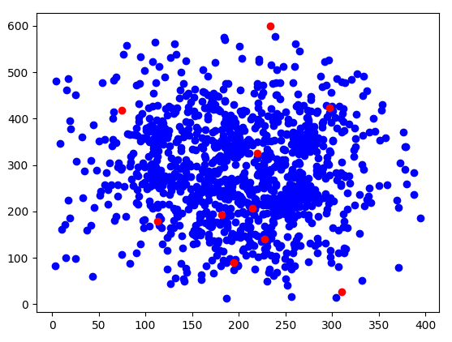
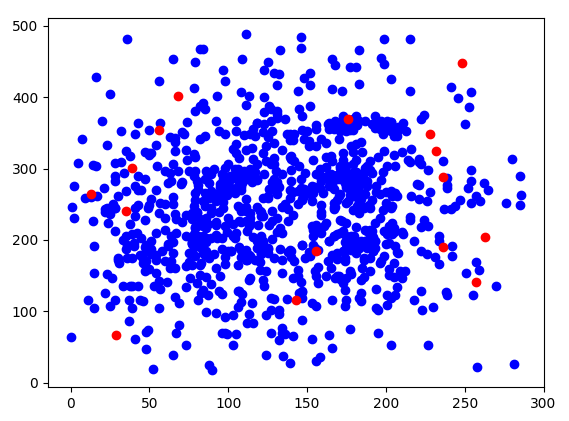
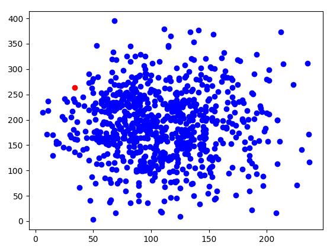

# Google Hash Code 2016

## 📋 Abstract

The Google Hash Code 2016 project aims to solve the problem of managing and coordinating drones for the efficient delivery of online orders. Autonomous drones, capable of flying and avoiding traffic, can be used to deliver products directly to customers. However, the main challenge lies in managing and coordinating these drones to optimize order fulfillment.

Full specifications of the problem : [subject.pdf](subject.pdf)

## 📦 The drone delivery problem

### 🗃 Datasets

The blue dots represents the orders and the red ones the warehouses.

#### Dataset A : a_example.in

  

#### Dataset B : b_busy_day.in

  

#### Dataset C : c_redudancy.in

  

#### Dataset D : d_mother_of_all_warehouses.in

  

### 📊 Strategies and Performances

Different algorithms have been tested, including:

- **Naïve** : The strategy of the naive algorithm is relatively simple. It uses an iterative approach to process orders one after the other, attempting to complete them one by one using available drones and warehouses.

  | Dataset                       | Score  |
  |-------------------------------|--------|
  | a_example.in                  | 234    |
  | b_busy_day.in                 | 89847  |
  | c_redudancy.in                | 90978  |
  | d_mother_of_all_warehouses.in | 71442  |

- **Product by Product** : The strategy of the product_by_product algorithm is based on processing each product individually, attempting to optimize the management of available quantities in warehouses and orders.

  | Dataset                       | Score  |
  |-------------------------------|--------|
  | a_example.in                  | 236    |
  | b_busy_day.in                 | 71393  |
  | c_redudancy.in                | 80744  |
  | d_mother_of_all_warehouses.in | 57812  |

- **Workload Repartition** : The strategy of the workload_repartition algorithm focuses on distributing the workload among drones to efficiently fulfill orders.

  | Dataset                       | Score  |
  | ------------------------------|--------|
  | a_example.in                  | 225    |
  | b_busy_day.in                 | 96937  |
  | c_redudancy.in                | 96079  |
  | d_mother_of_all_warehouses.in | 73615  |

- **Layers** : The strategy of the main_warehouse_layers algorithm involves dividing orders into multiple zones based on their proximity to the center of the challenge grid. Each zone is then processed independently, evaluating the potential solution obtained by workload distribution (workload_repartition). The zones are sorted based on their score, calculated by considering the number of successful actions completed in each zone. Finally, the zones are processed sequentially, with priority given to zones with the highest scores.

  | Dataset                       | Score  |
  | ------------------------------|--------|
  | a_example.in                  | 222    |
  | b_busy_day.in                 | 98548  |
  | c_redudancy.in                | 96185  |
  | d_mother_of_all_warehouses.in | 72993  |

- **Stack Segments** : 
The strategy of the stack_segments algorithm involves processing each order individually by building a segment for each order. For each order, the nearest warehouses are sorted by accessibility, and a dummy drone is used to simulate the loading and delivery process. The drone visits warehouses to load the requested products until its maximum capacity is reached or all products of the order are loaded. Then, the drone delivers these products to the order's destination.

  Once the order is completed, the actions performed by the dummy drone are recorded as a new segment. These segments are then sorted based on their total duration, and the least occupied drones prioritize handling the simplest segments to complete.

  | Dataset                       | Score  |
  |-------------------------------|--------|
  | a_example.in                  | 234    |
  | b_busy_day.in                 | 100880 |
  | c_redudancy.in                | 96415  |
  | d_mother_of_all_warehouses.in | 74869  |

### 🔧 Code architecture

The code is organized into classes, with functions dedicated to specific tasks. The classes include functionalities such as managing drones, warehouses, orders, as well as segments representing delivery routes.

#### Solver file

The file solver.py contains the main functions for solving the Google Hash challenge. These functions use various algorithms to generate optimal solutions. Here is an overview of the main functions:

- stack_segments(challenge): This function uses a segment-based approach to optimize the delivery of orders.

- naive(challenge): Implementation of a naive algorithm for the delivery of orders.

- workload_repartition(challenge): Efficiently distributes the workload among drones.

- main_warehouse_layers(challenge): Organizes orders into zones to improve their management.

- solve(challenge): Main function that evaluates and compares the solutions generated by different methods.

#### Parsing file

The file parser.py contains the functions needed to read and interpret Google Hash challenge definition files.

- parse_challenge(filename): Reads a Google Hash challenge file and extracts the necessary information.

#### Main file

The file main.py is the main entry point of the program. It uses the solving and parsing functions to generate a solution to the Google Hash challenge.

#### Other Classes

The project also includes several other essential classes, namely Drone.py, Order.py, Segment.py, Warehouse.py, and Challenge.py. These classes define the key entities of the problem and are used in the solving process.

## 🧑‍💻 Try it out !

1. Clone the current repository.
2. You can use a virtual environnment if you want at this point.
3. Install the required quality-analysis libraries : `pip install -r requirements.txt`
4. Run the following python script with the input file to use (in the `challenges` folder) and the name of the output file : 

  `python main.py challenges/a_example.in output`

**The algorithm that is executed is stack_segments. If you want to use other algorithms, simply uncomment them.**